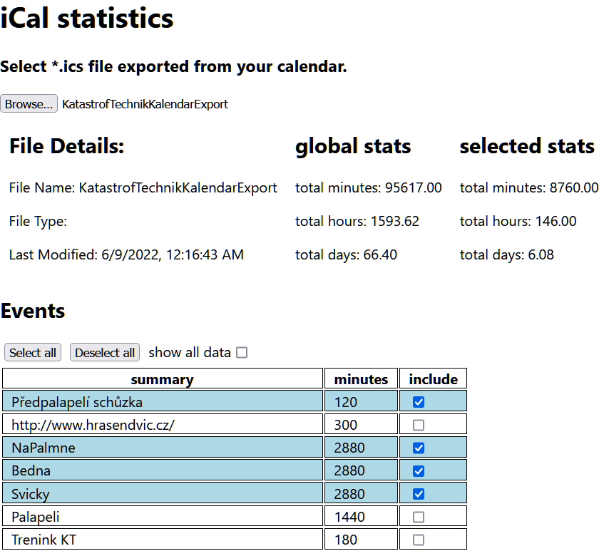

# iCalendarStatistics
Simple app that allows you to sum duration of events in ics files. It tranforms your *.ics files into table with some specified columns (currently only event summary and event duration in minutes). You can select which events should be included in sumation. 

## screenshot

## info
hosted https://www.michalkeda.com/icalstatistics/

## disclaimer
This was written as a learning exercise for reactjs, typescript and some other front-end technologies. I do not fear to fail to meet any expectations.